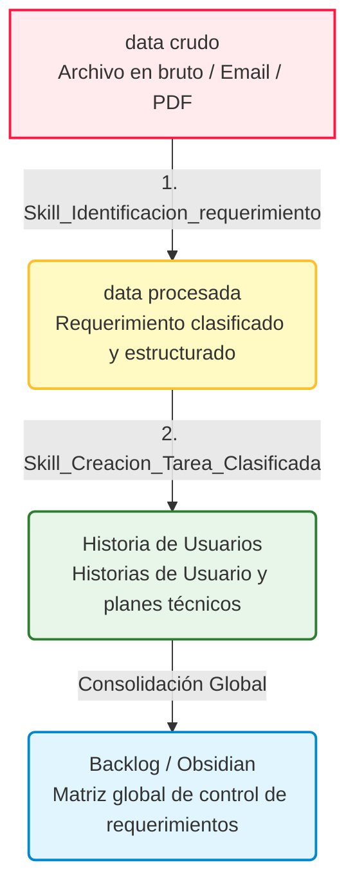

# 🤖 Directorio de Agentes (Inteligencia del Sistema)

Este directorio actúa como el **cerebro y núcleo operativo** del sistema de agentes inteligentes y automatizaciones del espacio de trabajo **Idea a Historias de Usuario**. Contiene las directrices de gobernanza, las habilidades de procesamiento cognitivo y la coreografía de flujos que guían la ejecución autónoma de los agentes para mantener el orden, la trazabilidad y la calidad del proyecto.

---

## 📂 Estructura del Directorio

El directorio `.agents` está organizado en tres componentes clave, cada uno con una responsabilidad definida en el ciclo de vida del procesamiento de requerimientos:

```text
.agents/
├── 📜 rules/
│   └── rules.md                # Normas de conducta y directrices obligatorias (Reglamento)
├── 🛠️ skills/
│   ├── 1. Skill_Identificacion_requerimiento.md   # Extracción estructurada de datos en crudo
│   ├── 2. Skill_Creacion_Tarea_Clasificada.md     # Transformación a Historias de Usuario
│   └── Matriz_de_clasificacion.md                 # Taxonomía y priorización de requerimientos
└── 🔄 workflows/
    └── flujo.md                # Orquestación y secuencia de ejecución de habilidades
```

### 1. 📜 Reglas (`rules/`)
* **Propósito:** Definir los límites éticos, lingüísticos y metodológicos del agente.
* **Archivo Clave:** `rules/rules.md`
  * **Reglamento Maestro:**
    * **Idioma:** Español neutro con un tono estrictamente profesional.
    * **Trazabilidad:** Documentación obligatoria de todas las acciones, cambios y decisiones en una línea de tiempo (Bitácora/Timeline).

### 2. 🛠️ Habilidades (`skills/`)
* **Propósito:** Definir los módulos especializados de capacidad cognitiva y las plantillas de salida que el agente puede invocar.
* **Archivos Claves:**
  * **[1. Skill_Identificacion_requerimiento.md](file:///c:/Users/Juan%20Pablo/Desktop/Curso%20Asesoria/.agents/skills/1.%20Skill_Identificacion_requerimiento.md):** Analiza datos desestructurados en la carpeta de entrada (`data crudo`), extrae las variables esenciales (Qué, Quién, Cómo, Cuándo, Dónde, Por qué), clasifica la solicitud y genera un requerimiento estandarizado en `data procesada`.
  * **[2. Skill_Creacion_Tarea_Clasificada.md](file:///c:/Users/Juan%20Pablo/Desktop/Curso%20Asesoria/.agents/skills/2.%20Skill_Creacion_Tarea_Clasificada.md):** Toma un requerimiento procesado con estado `"Para procesar"` de la carpeta `data procesada`, redacta una Historia de Usuario estructurada (Como/Quiero/Para), establece criterios de aceptación concretos, diseña un plan de ejecución técnica y lo guarda en `Historia de Usuarios`.
  * **[Matriz_de_clasificacion.md](file:///c:/Users/Juan%20Pablo/Desktop/Curso%20Asesoria/.agents/skills/Matriz_de_clasificacion.md):** El estándar de taxonomía del proyecto, categorizando cada solicitud en **Tarea** (Operativa/Técnica o Administrativa), **Seguimiento** (Estratégico/Proyectos o Comercial) o **Informativo** (Comunicado o Reporte) con prioridades de negocio asociadas.

### 3. 🔄 Flujos de Trabajo (`workflows/`)
* **Propósito:** Orquestar y automatizar secuencias lógicas combinando múltiples habilidades para resolver tareas complejas.
* **Archivo Clave:** `workflows/flujo.md`
  * Controla la ejecución paso a paso (pipeline) que va desde el análisis de la petición, la extracción y clasificación, hasta el desglose técnico y la validación final del reglamento.

---

## 🔄 El Pipeline de Procesamiento de Requerimientos

La interacción entre el sistema de agentes y el espacio de trabajo físico del proyecto sigue un flujo estructurado de transformación de datos:



### 🛣️ Viaje del Requerimiento en el Espacio de Trabajo
1. **Ingesta:** Los requerimientos iniciales se colocan en `data crudo/`.
2. **Análisis y Clasificación:** El agente ejecuta la **Skill 1**, moviendo el archivo original a `Data Crudo procesada/` y creando la versión estructurada con estado `"Para procesar"` en `data procesada/`.
3. **Desglose Ágil:** El agente ejecuta la **Skill 2**, transformando la solicitud en una Historia de Usuario en `Historia de Usuarios/` y actualizando el estado en `data procesada/` a `"Procesado"`.
4. **Gobernanza:** Todo el backlog consolidado se mapea y centraliza de forma transparente en `Backlog/Matriz_Historias_Usuario.md`.

---

## 📅 Timeline de Decisiones del Directorio

Cualquier cambio estructural, modificación de habilidades o adición de reglas a este directorio de agentes se registra de acuerdo con el **#reglamento** del proyecto:

| Fecha | Versión | Tipo de Cambio | Descripción del Cambio / Decisión | Autor |
| :--- | :--- | :--- | :--- | :--- |
| 2026-05-19 | v1.0 | Creación | Inicialización del archivo de documentación central `README.md` del directorio `.agents`. | Antigravity AI |

---
> [!NOTE]
> Este directorio está protegido bajo las reglas de gobierno de agentes. Cualquier modificación en los archivos de esta carpeta debe ser analizada detalladamente para evitar inconsistencias en el procesamiento automático del backlog y el flujo de requerimientos.
